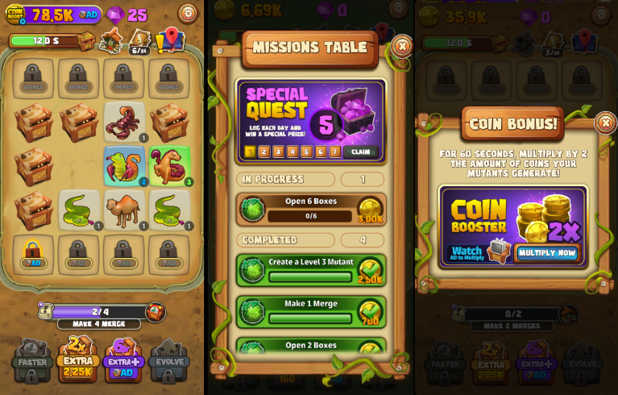
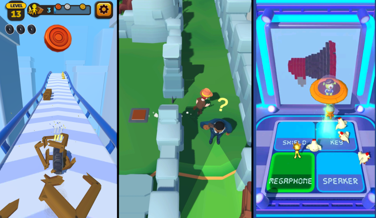
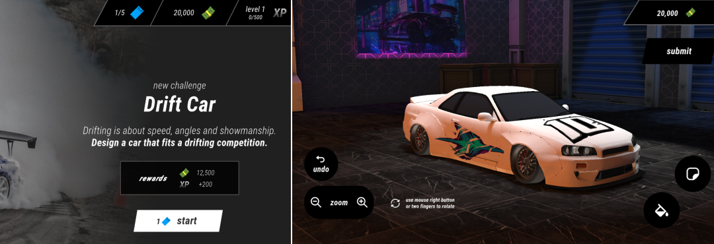
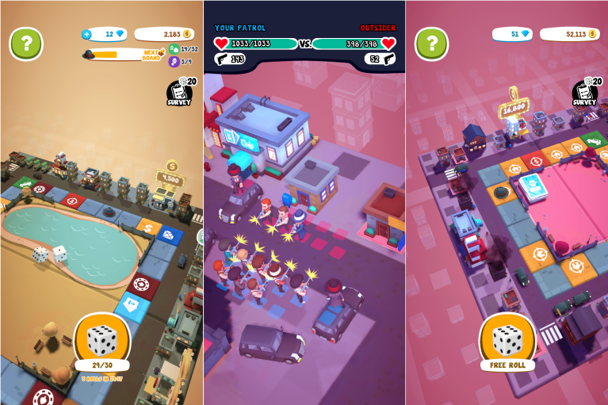
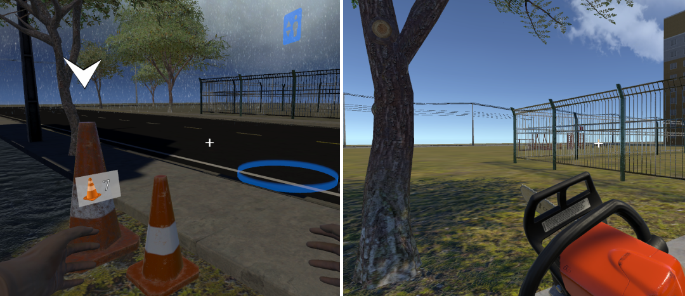

# Hello and welcome! 

With 10+ [mobile games](#featured-projects), a [multiplayer VR simulator](#featured-projects) for PC, 5 [playable demonstrations](#demonstration-projects) and a lot of [code snippets (tips)](https://github.com/alissin/little-big-tips){:target="_blank"} on GitHub, I'm a _**Gameplay Programmer**_ with experience in developing gameplay mechanics for entertainment and educational game-focused applications. I also have a mobile development background with 10+ applications and 15+ years of software development experience.

Below you can **download** some of the [Featured Projects](#featured-projects) and **play online** the [Demonstrations](#demonstration-projects).

As an **extension** of this Portfolio, take a look at my [GitHub](https://github.com/alissin/little-big-tips){:target="_blank"} **repository**. You'll see the implementations of the main mechanics that were used in these [Demonstrations](#demonstration-projects) and some [VFX](#vfx-demonstrations) (Shader and Particle) examples.

By the way, if you are a programmer / developer, I really appreciate if these [code snippets](https://github.com/alissin/little-big-tips){:target="_blank"} could help you!

# Portfolio 

[Featured Projects](#featured-projects) 
[Demonstration Projects](#demonstration-projects) 
[VFX Demonstrations](#vfx-demonstrations) 
[Game Jam Projects](#game-jam-projects)

## Featured Projects

Some production projects already published:

###	Mut Merge - Merge and Idle game

> 

A merge/idle game with multiple biomes, a lot of features like currency, boosts, collection as well as an enjoyable progressive quest and reward system. 2022, 3 months. 
Get it on [Play Store](https://play.google.com/store/apps/details?id=com.Hoplon.ProjectEden){:target="_blank"}.

**My responsibilities:**
* progressive quest and reward system;
* monetization and ads implementation;

###	Hyper-casual games

> 

Many hyper-casual game prototypes. 2022, 6 months.

**My responsibilities:**
* reusable gameplay mechanics for different games like: infinity runner, wheel/tire physics simulation, joystick player control, enemy patrol and chase, quest and dialog system, voxel;

###	Car Styler - Contest Game

> 

A prototype of a car design contest game with a 3D customization using decals. 2021, 3 months.

**My responsibilities:**
* UI flow navigation;
* 3D customization environment integration;
* contest mechanic (customize, publish, voting);

###	Dice Mafia - Board Game 

> 

A 3D board game with some very nice features like: a progression system (multiple boards), a building (housing) upgrade system as well as invasion and battle systems. 2021, 4 months.

**My responsibilities:**
* Invasion and battle systems simulation;
* Progression and bulding upgrade systems;
* Multiple boards mechanic (prototype);
* 3D models and animations interaction;

###	VR Multiplayer Game / Simulator - AVI

> 

A Multiplayer VR electrician training simulator for PC. 2020-2021, 1 year, 4 months.

**My responsibilities:**
* Hybrid input system: VR, keyboard and mouse, gamepad;
* Different weather conditions (rain, wind, thunder, lightning) and periods of the day (day, night) as well as some shader development like different tree movements depending on weather conditions;
* Multiplayer base architecture using a 3rd party library;
* State machine to control different training exercises;
* Inventory system;
* Collect and Interact with items in the scenario; 

###	Porta Aberta RA

> 

A 3D mobile game that uses the Augmented Reality to present information about a teaching method to schools. 2019, 2 months. 
Download on the [Apple Store](https://apps.apple.com/us/app/porta-aberta-ra/id1464966853){:target="_blank"}.

**My responsibilities:**
* Augmented Reality;
* Vuforia integration;
* 3D models and animations interaction;

### CPFL Energia em Jogo

> 

A 2D isometric game with simple RPG mechanics that teaches kids how to save electricity at home. 2019, 3 months. 
Get it on [Play Store](https://play.google.com/store/apps/details?id=br.com.energiaemjogo.cpfl){:target="_blank"}.

**My responsibilities:**
* basic finite-state machine mechanic to control the player's actions and states, integrated with a basic RPG and time based mechanic (health, stamina (happiness));
* player's animations (sprite sheet) interaction and control;
* event based system;
* REST api remote access (network) like multiple users login / ranking points;

### Motherly

> 

A 2D / mobile app to help women in their pregnancy process. 2019, 1 month. 
Get it on [Play Store](https://play.google.com/store/apps/details?id=com.perugluglu.motherly){:target="_blank"}.

**My responsibilities:**
* screen template and dynamic flow mechanic, filled and organized in runtime;
* save/load game files system;

## Demonstration Projects

Prototypes to show some cool gameplay techniques (personal projects):

###	The Dungeon

> <iframe width="850" height="480" src="https://www.youtube.com/embed/HW0HqRA1Scs" frameborder="0" allow="accelerometer; autoplay; encrypted-media; gyroscope; picture-in-picture" allowfullscreen></iframe>

"Escape from this mysterious dungeon!" 
A FPS action RPG style game, developed in 2020. 
Play it on [simmer.io](https://simmer.io/@alissin/the-dungeon){:target="_blank"}.

_Note_: The purpose of this demonstration is to evaluate the gameplay mechanics listed below. The FPS shooter gameplay mechanic itself, the scenario and the props are free assets from the Asset Store.

**Mechanics / techniques I used:**
* command pattern ➤ [`code snippet`](https://github.com/alissin/little-big-tips/tree/master/_pattern-algorithm/command){:target="_blank"}
* component pattern ➤ [`code snippet`](https://github.com/alissin/little-big-tips/tree/master/_pattern-algorithm/component){:target="_blank"}
* flyweight pattern ➤ [`code snippet`](https://github.com/alissin/little-big-tips/tree/master/_pattern-algorithm/flyweight){:target="_blank"}
* state pattern ➤ [`code snippet`](https://github.com/alissin/little-big-tips/tree/master/_pattern-algorithm/state){:target="_blank"}
* drop item by chance ➤ [`code snippet`](https://github.com/alissin/little-big-tips/tree/master/drop-item-by-chance){:target="_blank"}
* hit damage calculation ➤ [`code snippet`](https://github.com/alissin/little-big-tips/tree/master/hit-damage-calculation){:target="_blank"}
* raycast patrol detection ➤ [`code snippet`](https://github.com/alissin/little-big-tips/tree/master/raycast-patrol-detection){:target="_blank"}

###	Realm Defender

> <iframe width="850" height="480" src="https://www.youtube.com/embed/3RJa7A2lHqE" frameborder="0" allow="accelerometer; autoplay; encrypted-media; gyroscope; picture-in-picture" allowfullscreen></iframe>

"Defend your realm from the strong enemy warriors. Use everything you have!" 
A 3D pathfinder / tower defence style game, developed in 2019. 
Play it on [simmer.io](https://simmer.io/@alissin/realm-defender){:target="_blank"}.

_Note_: The purpose of this demonstration is to evaluate the gameplay mechanics listed below. The scenario and the props are free assets from the Asset Store.

**Mechanics / techniques I used:**
* pathfinder using Breadth First Search ➤ [`code snippet`](https://github.com/alissin/little-big-tips/tree/master/_pattern-algorithm/breadth-first-search){:target="_blank"}
* object pool pattern ➤ [`code snippet`](https://github.com/alissin/little-big-tips/tree/master/_pattern-algorithm/object-pool){:target="_blank"}
* observer pattern ➤ [`code snippet`](https://github.com/alissin/little-big-tips/tree/master/_pattern-algorithm/observer){:target="_blank"}
* raycast 3D click / touch detection ➤ [`code snippet`](https://github.com/alissin/little-big-tips/tree/master/raycast-3D-click-detection){:target="_blank"}
* simple cooldown ➤ [`code snippet`](https://github.com/alissin/little-big-tips/tree/master/simple-cooldown){:target="_blank"}

###	Combat Wings

> <iframe width="850" height="480" src="https://www.youtube.com/embed/cYuWADYG_vc" frameborder="0" allow="accelerometer; autoplay; encrypted-media; gyroscope; picture-in-picture" allowfullscreen></iframe>

"Defend your planet from the rogue robots!" 
A 3rd person path rail shooter, developed in 2019. 
Play it on [simmer.io](https://simmer.io/@alissin/combat-wings){:target="_blank"}.

_Note_: The purpose of this demonstration is to evaluate the gameplay mechanics listed below. The scenario and the props are free assets from the Asset Store.

**Mechanics / techniques I used:**
* airplane movement ➤ [`code snippet`](https://github.com/alissin/little-big-tips/tree/master/airplane-movement){:target="_blank"}
* simple damage shake ➤ [`code snippet`](https://github.com/alissin/little-big-tips/tree/master/simple-damage-shake){:target="_blank"}
* singleton pattern ➤ [`code snippet`](https://github.com/alissin/little-big-tips/tree/master/_pattern-algorithm/singleton){:target="_blank"}

###	Boost the Rocket

> <iframe width="850" height="480" src="https://www.youtube.com/embed/dQG2FUZd22M" frameborder="0" allow="accelerometer; autoplay; encrypted-media; gyroscope; picture-in-picture" allowfullscreen></iframe>

"Be strong and boost the rocket wisely to escape these space dungeons!" 
A 2.5D game that uses physics to control the gravity of the rocket. You can launch it smoothly, but be careful to land it! Developed in 2019. 
Play it on [simmer.io](https://simmer.io/@alissin/boost-the-rocket){:target="_blank"}.

**Mechanics / techniques I used:**
* land the rocket ➤ [`code snippet`](https://github.com/alissin/little-big-tips/tree/master/land-the-rocket){:target="_blank"}
* explode the rocket ➤ [`code snippet`](https://github.com/alissin/little-big-tips/tree/master/explode-the-rocket){:target="_blank"}

###	Goal Dribble

> <iframe width="850" height="480" src="https://www.youtube.com/embed/e6-BrcPI4xc" frameborder="0" allow="accelerometer; autoplay; encrypted-media; gyroscope; picture-in-picture" allowfullscreen></iframe>

"As a good soccer striker, sometimes you have to finish the play and make the goal!" 
A 3D fast-paced twitch humble version inspired in Super Hexagon and my first game in Unity! Developed in 2018. 
Play it on [simmer.io](https://simmer.io/@alissin/goal-dribble){:target="_blank"}.

_Note_: The purpose of this demonstration is to evaluate the gameplay mechanics listed below. The textures and the sprites are free assets from the Asset Store.

**Mechanics / techniques I used:**
* roll the ball ➤ [`code snippet`](https://github.com/alissin/little-big-tips/tree/master/roll-the-ball){:target="_blank"}

## VFX Demonstrations

Some nice visual effects with Shader and Particle System:

> 

* flag animation shader ➤ [`code snippet`](https://github.com/alissin/little-big-tips/tree/master/_vfx/flag-animation-shader){:target="_blank"}

> 

* lava animation shader ➤ [`code snippet`](https://github.com/alissin/little-big-tips/tree/master/_vfx/lava-animation-shader){:target="_blank"}

> 

* sky rotation shader ➤ [`code snippet`](https://github.com/alissin/little-big-tips/tree/master/_vfx/sky-rotation-shader){:target="_blank"}

> 

* birds flight particle ➤ [`code snippet`](https://github.com/alissin/little-big-tips/tree/master/_vfx/birds-flight-particle){:target="_blank"}

> 

* smoke particle ➤ [`code snippet`](https://github.com/alissin/little-big-tips/tree/master/_vfx/smoke-particle){:target="_blank"}

## Game Jam Projects

Some game jam projects that I had a lot of fun:

###	My Little Cyborg

> 

A simple 2D casual mobile game using Unity that allows the player to personalize it's damaged robot character as it's favorite hero robot. 
Global Game Jam 2020, 48 hours. The theme was **Repair** 
See more on the [Global Game Jam](https://globalgamejam.org/2020/games/my-little-cyborg-4){:target="_blank"} project page.

**My responsibilities:**
* all code programming;

###	Colab Repair

> 

A simple 2D casual game using Godot that two players need to collaborate to repair their house. 
Global Game Jam 2020, 48 hours. The theme was **Repair** 
See more on the [Global Game Jam](https://globalgamejam.org/2020/games/colab-repair-5){:target="_blank"} project page.

**My responsibilities:**
* base player locomotion programming;
* design coparticipation;

# Contact 

Do you have an interesting project in mind? I'm open for professional opportunities and I'd love to help!

{:target="_blank"}
{:target="_blank"}
{:target="_blank"}
{:target="_blank"}
