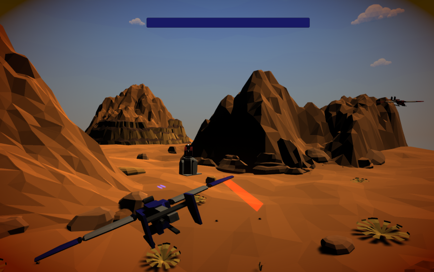

# Hello and welcome! 

With 3 [published mobile games](#featured-projects), 5 [playable demonstrations](#demonstration-projects) and a lot of [code snippets (tips)](https://github.com/alissin/little-big-tips){:target="_blank"} on GitHub, I'm a _**Unity Gameplay Developer / Programmer**_ with experience in developing gameplay mechanics for entertainment and educational game-focused applications, as well as design patterns and level design. I also have a mobile development background with 10+ applications and 10+ years of software development experience.

Below you can **download** the [Featured Projects](#featured-projects) and **play online** the [Demonstrations](#demonstration-projects).

As an **extension** of this Portfolio, take a look at my [GitHub](https://github.com/alissin/little-big-tips){:target="_blank"} **repository**. You'll see the implementations of the main mechanics that were used in these [Demonstrations](#demonstration-projects) and the [VFX](#vfx-demonstrations).

By the way, if you are a developer, I really appreciate if these [code snippets](https://github.com/alissin/little-big-tips){:target="_blank"} could help you! 
If you want to play online the Demonstrations, [go ahead](https://simmer.io/@alissin){:target="_blank"}!

# Portfolio 

[Featured Projects](#featured-projects) 
[Demonstration Projects](#demonstration-projects) 
[VFX Demonstrations](#vfx-demonstrations) 
[Game Jam Projects](#game-jam-projects)

## Featured Projects

Some production projects already published:

###	Porta Aberta RA

> 

A 3D mobile game with Augmented Reality for education purposes. 2019, 2 months. 
Download on the [Apple Store](https://apps.apple.com/us/app/porta-aberta-ra/id1464966853){:target="_blank"}.

**My responsibilities:**
* Augmented Reality;
* Vuforia integration;
* 3D models and animations interaction;

### CPFL Energia em Jogo

> 

An isometric 2D game with RPG mechanic for education purposes in saving power. 2019, 3 months. 
Get it on [Play Store](https://play.google.com/store/apps/details?id=br.com.energiaemjogo.cpfl){:target="_blank"}.

**My responsibilities:**
* basic finite-state machine mechanic to control the player's actions and states;
* player's animations (sprite sheet) interaction and control;
* event based system;
* REST api remote access (network) like multiple users login / ranking points;
* FSM integration with a basic RPG and time based mechanic (health, stamina (happiness));

### Motherly

> 

A 2D / mobile app to help women in their pregnancy process. 2019, 1 month. 
Get it on [Play Store](https://play.google.com/store/apps/details?id=com.perugluglu.motherly){:target="_blank"}.

**My responsibilities:**
* screen template and dynamic flow mechanic, filled and organized in runtime;
* save/load (encrypted) game files system;

## Demonstration Projects

Prototypes to show some cool gameplay techniques (personal projects):

###	The Dungeon

> 

"Escape from this mysterious dungeon!" 
A FPS action RPG style game, developed in 2020. 
Play it on [simmer.io](https://simmer.io/@alissin/the-dungeon){:target="_blank"}.

_Note_: The purpose of this demonstration is to evaluate the gameplay mechanics listed below. The FPS shooter gameplay mechanic itself, the amazing scenario and the props are free assets from the Asset Store.

**Mechanics / techniques I used:**
* command pattern ➤ [`code snippet`](https://github.com/alissin/little-big-tips/tree/master/_pattern-algorithm/command){:target="_blank"}
* component pattern ➤ [`code snippet`](https://github.com/alissin/little-big-tips/tree/master/_pattern-algorithm/component){:target="_blank"}
* flyweight pattern ➤ [`code snippet`](https://github.com/alissin/little-big-tips/tree/master/_pattern-algorithm/flyweight){:target="_blank"}
* state pattern ➤ [`code snippet`](https://github.com/alissin/little-big-tips/tree/master/_pattern-algorithm/state){:target="_blank"}
* drop item by chance ➤ [`code snippet`](https://github.com/alissin/little-big-tips/tree/master/drop-item-by-chance){:target="_blank"}
* hit damage calculation ➤ [`code snippet`](https://github.com/alissin/little-big-tips/tree/master/hit-damage-calculation){:target="_blank"}
* raycast patrol detection ➤ [`code snippet`](https://github.com/alissin/little-big-tips/tree/master/raycast-patrol-detection){:target="_blank"}

###	Realm Defender

> 

"Defend your realm from the strong enemy warriors. Use everything you have!" 
A 3D pathfinder / tower defence style game, developed in 2019. 
Play it on [simmer.io](https://simmer.io/@alissin/realm-defender){:target="_blank"}.

_Note_: The purpose of this demonstration is to evaluate the gameplay mechanics listed below. The amazing scenario and the props are free assets from the Asset Store.

**Mechanics / techniques I used:**
* pathfinder using Breadth First Search ➤ [`code snippet`](https://github.com/alissin/little-big-tips/tree/master/_pattern-algorithm/breadth-first-search){:target="_blank"}
* object pool pattern ➤ [`code snippet`](https://github.com/alissin/little-big-tips/tree/master/_pattern-algorithm/object-pool){:target="_blank"}
* observer pattern ➤ [`code snippet`](https://github.com/alissin/little-big-tips/tree/master/_pattern-algorithm/observer){:target="_blank"}
* raycast 3D click / touch detection ➤ [`code snippet`](https://github.com/alissin/little-big-tips/tree/master/raycast-3D-click-detection){:target="_blank"}
* simple cooldown ➤ [`code snippet`](https://github.com/alissin/little-big-tips/tree/master/simple-cooldown){:target="_blank"}

###	Combat Wings

> 

"Defend your planet from the rogue robots!" 
A 3rd person path rail shooter, developed in 2019. 
Play it on [simmer.io](https://simmer.io/@alissin/combat-wings){:target="_blank"}.

_Note_: The purpose of this demonstration is to evaluate the gameplay mechanics listed below. The amazing scenario and the props are free assets from the Asset Store.

**Mechanics / techniques I used:**
* airplane movement ➤ [`code snippet`](https://github.com/alissin/little-big-tips/tree/master/airplane-movement){:target="_blank"}
* simple damage shake ➤ [`code snippet`](https://github.com/alissin/little-big-tips/tree/master/simple-damage-shake){:target="_blank"}
* singleton pattern ➤ [`code snippet`](https://github.com/alissin/little-big-tips/tree/master/_pattern-algorithm/singleton){:target="_blank"}

###	Boost the Rocket

> 

"Be strong and boost the rocket wisely to escape these space dungeons!" 
A 2.5D game that uses physics to control the gravity of the rocket. You can launch it smoothly, but be careful to land it! Developed in 2019. 
Play it on [simmer.io](https://simmer.io/@alissin/boost-the-rocket){:target="_blank"}.

**Mechanics / techniques I used:**
* land the rocket ➤ [`code snippet`](https://github.com/alissin/little-big-tips/tree/master/land-the-rocket){:target="_blank"}
* explode the rocket ➤ [`code snippet`](https://github.com/alissin/little-big-tips/tree/master/explode-the-rocket){:target="_blank"}

###	Goal Dribble

> 

"As a good soccer striker, sometimes you have to finish the play and make the goal!" 
A 3D fast-paced twitch humble version inspired in Super Hexagon and my first game in Unity! Developed in 2018. 
Play it on [simmer.io](https://simmer.io/@alissin/goal-dribble){:target="_blank"}.

_Note_: The purpose of this demonstration is to evaluate the gameplay mechanics listed below. The textures and the sprites are free assets from the Asset Store.

**Mechanics / techniques I used:**
* roll the ball ➤ [`code snippet`](https://github.com/alissin/little-big-tips/tree/master/roll-the-ball){:target="_blank"}

## VFX Demonstrations

Some nice visual effects with Shader and Particle System:

> 

* flag animation shader ➤ [`code snippet`](https://github.com/alissin/little-big-tips/tree/master/_vfx/flag-animation-shader){:target="_blank"}

> 

* lava animation shader ➤ [`code snippet`](https://github.com/alissin/little-big-tips/tree/master/_vfx/lava-animation-shader){:target="_blank"}

> 

* sky rotation shader ➤ [`code snippet`](https://github.com/alissin/little-big-tips/tree/master/_vfx/sky-rotation-shader){:target="_blank"}

> 

* birds flight particle ➤ [`code snippet`](https://github.com/alissin/little-big-tips/tree/master/_vfx/birds-flight-particle){:target="_blank"}

> 

* smoke particle ➤ [`code snippet`](https://github.com/alissin/little-big-tips/tree/master/_vfx/smoke-particle){:target="_blank"}

## Game Jam Projects

Some game jam projects that I had a lot of fun:

###	My Little Cyborg

> 

A simple 2D casual mobile game using Unity that allows the player to personalize it's damaged robot character as it's favorite hero robot. 
Global Game Jam 2020, 48 hours. The theme was **Repair** 
See more on the [Global Game Jam](https://globalgamejam.org/2020/games/my-little-cyborg-4){:target="_blank"} project page.

**My responsibilities:**
* all code programming;

###	Calab Repair

> 

A simple 2D casual game using Godot that two players need to collaborate to repair their house. 
Global Game Jam 2020, 48 hours. The theme was **Repair** 
See more on the [Global Game Jam](https://globalgamejam.org/2020/games/colab-repair-5){:target="_blank"} project page.

**My responsibilities:**
* base player locomotion programming;
* design coparticipation;

# teste

<iframe width="560" height="315" src="https://www.youtube.com/embed/ciC5yaOy-S0" frameborder="0" allow="accelerometer; autoplay; encrypted-media; gyroscope; picture-in-picture" allowfullscreen></iframe>

# teste

# Contact 

Do you have an interesting project in mind? I'm open for professional opportunities and I'd love to help!

{:target="_blank"}
{:target="_blank"}
{:target="_blank"}

[comment]: <{:target="_blank"}>